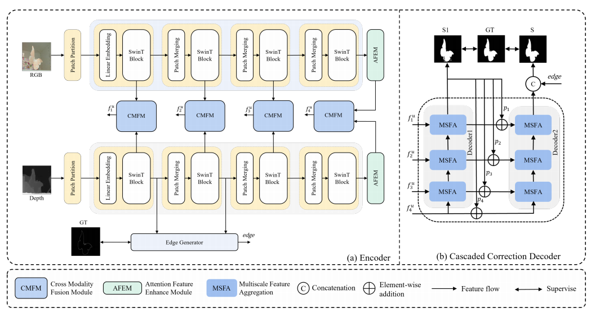
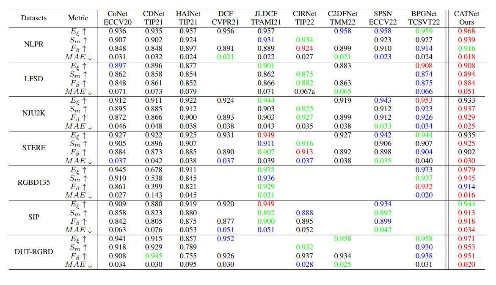
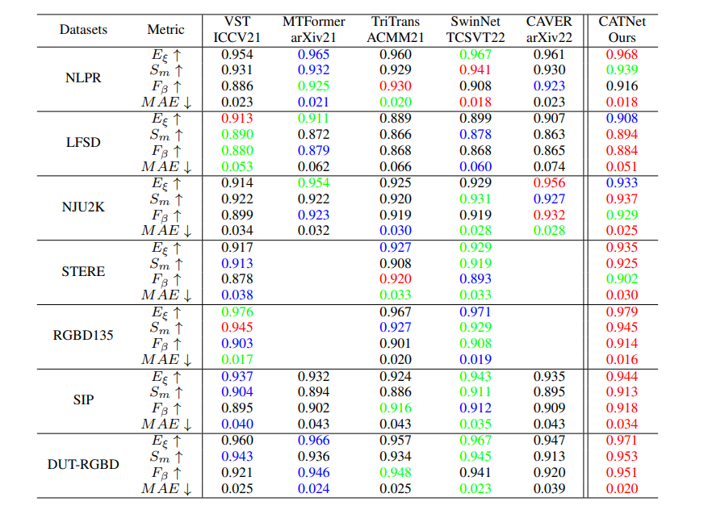

# **CATNet: A Cascaded and Aggreated Vision Transformer Network for RGB-D Salient Object Detection**

## Network Architecture

## Requirements
python 3.9

pytorch 1.11.0

tensorboardX 2.5
## Results and Saliency maps
We provide saliency maps([baidu (code:)](https://note.youdao.com/) | [Google Drive](https://note.youdao.com/)) of our CATNet on 7 datasets(NLPR,NJU2K,STERE,SIP,LFSD,DUT-RGBD,RGB135).
We Perform Quantitative Comparisons  With CNN-Based RGB-D SOD
Methods On Seven  RGB-D Datasets.

We Perform Quantitative Comparisons  With Transformer-Based RGB-D SOD
Methods On Seven  RGB-D Datasets.

## Training
Please run 
```
CatNet_train.py
```
## Pre-trained model and testing
- Download the following pre-trained models and put them in /pretrain.
- Modify pathes of pre-trained models and datasets.
- Run 
```
CatNet_test.py
```
Datasets:
[Baidu(code:)](https://note.youdao.com/) | [Google Drive](https://note.youdao.com/)

Our pre-trained models(CATNet):
[Baidu(code:)](https://note.youdao.com/) | [Google Drive](https://note.youdao.com/)


