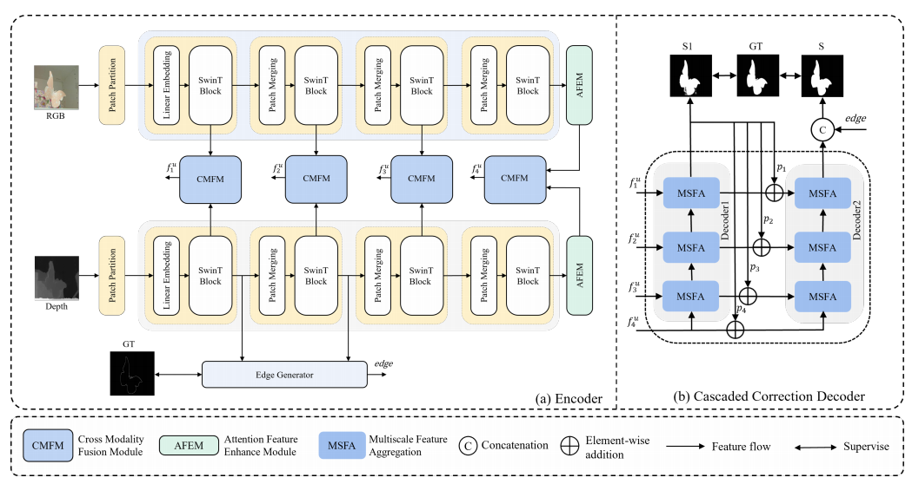

# CATNet: A Cascaded and Aggregated Transformer Network For RGB-D Salient Object Detection
The paper has been online published by IEEE Transactions on Multimedia. 



## Requirements
python 3.9

pytorch 1.11.0

tensorboardX 2.5
## Results and Saliency maps
We provide [saliency maps](https://drive.google.com/file/d/1USRmpamaV5RJyI3iWp3J12bIZ0i-kbjr/view?usp=sharing) of our CATNet on 7 datasets.
## Training
Please run 
```
CatNet_train.py
```
## Pre-trained model and testing
- Download the following pre-trained models ([Swin Transformer](https://github.com/SwinTransformer/storage/releases/download/v1.0.0/swin_base_patch4_window12_384_22k.pth)) and put them in /pre.
- Modify pathes of pre-trained models and datasets.
- Run 
```
CatNet_test.py
```
## Downloading Training and Testing Datasets:
- Download the [training set](https://drive.google.com/file/d/1BPt09rbgSYQcu0LpQoKSNVgXA3aYvkF7/view?usp=sharing) used for training.
- Download the [testing sets](https://drive.google.com/file/d/1wAVNEYDrTZK7oWB4J-3MTXmAo1AsVZCj/view?usp=sharing) used for testing.

## Citation
If you find this work is useful for your research, please cite our paper:
```
@article{10179145,
  author={Sun, Fuming and Ren, Peng and Yin, Bowen and Wang, Fasheng and Li, Haojie},
  journal={IEEE Transactions on Multimedia}, 
  title={CATNet: A Cascaded and Aggregated Transformer Network For RGB-D Salient Object Detection}, 
  year={2023},
  volume={},
  number={},
  pages={1-14},
  doi={10.1109/TMM.2023.3294003}}
```

If you anywhere questions, please tell me 724162106@qq.com.
